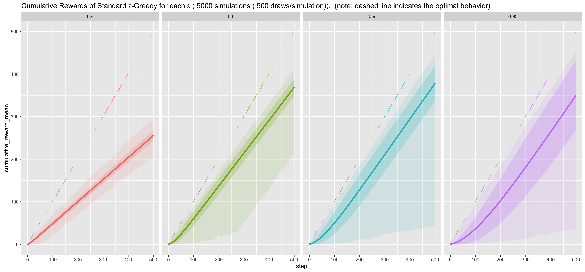

# banditsbook-scala


This repository is inspired by [johnmyleswhite/BanditsBook][johnmyleswhite/BanditsBook].

This contains Scala implementations (with [breeze][breeze] and [cats][cats]) of several standard algorithms for solving the Multi-Armed Bandits Problem, including:

* [x] epsilon-Greedy
* [x] Softmax (Boltzmann)
* [x] UCB1
* [ ] UCB2
* [x] Hedge
* [x] Exp3
* [ ] annealing versions of aboves

It also contains code that provides a testing framework for bandit algorithms based around simple Monte Carlo simulations.

## Languages and design overview
All implementations are in Scala.  If you're interested in other language, please see [johnmyleswhite/BanditsBook].

This bandits algorithms are implemented by functional and stateless style.  Algorithm behavior is modeled as State Monad by using [cats][cats] (please see [Demo.scala][Demo.scala]).

Implementing bandits algorithm needs to linear algebra(vector/matrix calculations) and probability calculations.  This implementation uses [breeze][breeze] for those features.

## Getting Started
To try out this code, you can go to [Demo.scala][Demo.scala] and then run the demo.

```
// run the demo written in procedural manner (but it is stateless.)
sbt "run-main com.github.everpeace.banditsbook.Demo"

// run the demo written in monadic manner
sbt "run-main com.github.everpeace.banditsbook.DemoMonadic"
```

You should step through that code line-by-line to understand what the functions are doing. The book provides more in-depth explanations of how the algorithms work.

## Simulations
This repository includes some handy scripts to run simulations.

* Prerequisites:
  * [sbt](http://www.scala-sbt.org/)
  * [R](https://www.r-project.org)  (for plotting simulation results)

To run simulations, just hit the commands

```
// this takes some time, you can enjoy a cup of coffee :-).
$ cd banditsbook-scala
$ ./run_test.sh all
```

This will executes to run simulations on the configurations defined in [application.conf](src/main/resources/application.conf) and generate graphs of simulation results to `output` directory like an image on the top.  Please note that all arms are simulated by Bernoulli distributions.

## Adding New Algorithms: API Expectations
[Algorithm][Algorithm.scala] is defined as below:

```
// Reward         : type of reward which this algorithm work for.
// AlgorithmState : type of state which the algorithm handles.
abstract class Algorithm[Reward, AlgorithmState] {

  // The method works for initialization.
  // Given arms, returns state value of this algorithm
  def initialState(arms: Seq[Arm[Reward]]): AlgorithmState

  // The method that returns the index of the Arm
  // that the algorithm selects on the current play.
  def selectArm(arms: Seq[Arm[Reward]], state: AlgorithmState): Int

  // The method calculates next state of the algorithm
  // in response to its most recently selected arm's reward.
  def updateState(arms: Seq[Arm[Reward]], state: AlgorithmState, chosen: Int, reward: Reward): AlgorithmState

  //
  // State Monadic Values:
  //   These values are induced from above methods.
  //   This means you can get a monadic algorithm
  //   instance for free!
  //
  import cats.data.State
  import State._
  def selectArm: State[(Seq[Arm[Reward]], AlgorithmState), Arm[Reward]] =
    inspect {
      case (arms, state) =>
        arms(selectArm(arms, state))
    }

  def updateState(chosenArm:Arm[Reward], reward: Reward): SState[(Seq[Arm[Reward]], AlgorithmState), AlgorithmState] =
    inspect {
      case (arms, state) =>
        updateState(arms, state, arms.indexOf(chosenArm), reward)
    }
}
```

You may need to implement your own arm simulator.  Arm is modeled by `breeze.stats.distributions.Rand[+T]`.  Please refer to [Arms.scala][Arms.scala] for typical arm implementations.

## License
The MIT License (MIT)

Copyright (c) 2016 Shingo Omura

## Contributions
Contributions are welcome :-)  There are no complicated regulations. Feel free to open issues and pull requests!

[johnmyleswhite/BanditsBook]: https://github.com/johnmyleswhite/BanditsBook
[breeze]: https://github.com/scalanlp/breeze
[cats]: https://github.com/typelevel/cats
[Demo.scala]: src/main/scala/com/github/everpeace/banditsbook/Demo.scala
[Algorithm.scala]: src/main/scala/com/github/everpeace/banditsbook/algorithm/Algorithm.scala
[Arms.scala]: /src/main/scala/com/github/everpeace/banditsbook/arm/Arms.scala
